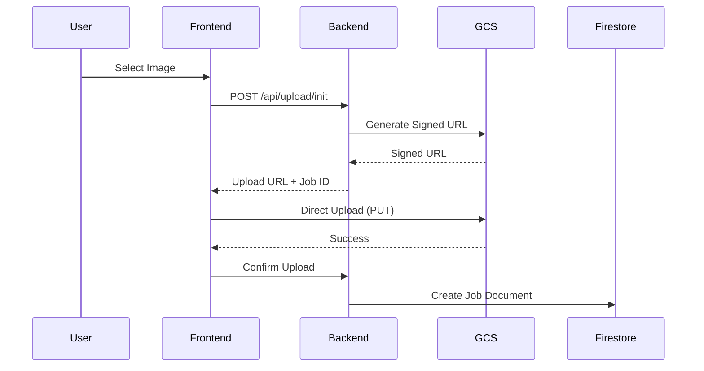
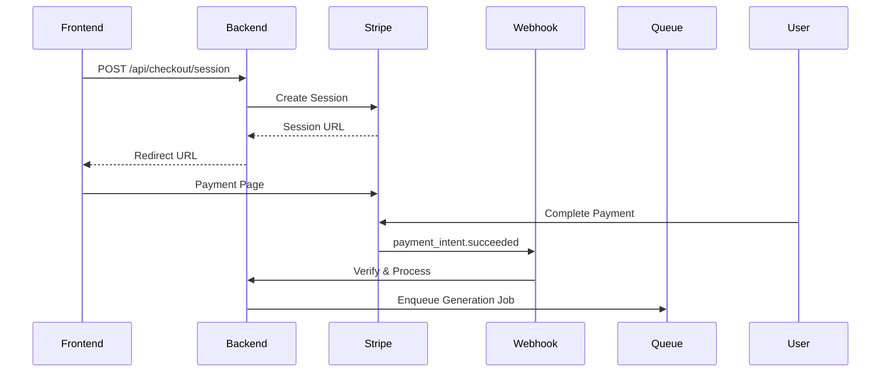
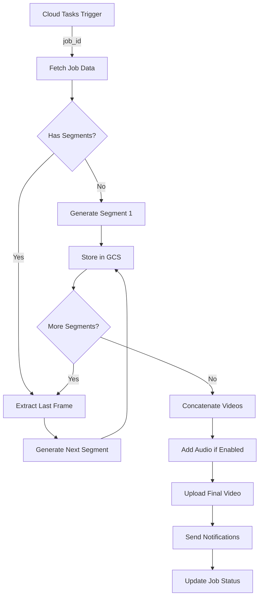

# 🏗️ Architecture Technique Détaillée

## Vue d'Ensemble

AnimateMyPicture est une plateforme SaaS de génération vidéo par IA construite sur une architecture cloud-native, serverless et event-driven.

## 🎯 Principes Architecturaux

### 1. **Separation of Concerns**
- **Frontend** : Pure présentation et UX
- **Backend** : Logique métier et orchestration
- **Services** : Modules spécialisés réutilisables
- **Infrastructure** : Gérée comme code (IaC)

### 2. **Scalabilité Horizontale**
- Stateless services
- Queue-based processing
- Auto-scaling sur Cloud Run
- Load balancing automatique

### 3. **Resilience & Fault Tolerance**
- Circuit breakers
- Retry policies avec backoff exponentiel
- Dead letter queues
- Health checks multi-niveaux

## 📐 Architecture Système

```
┌─────────────────────────────────────────────────────────────────┐
│                         CLIENTS                                 │
├─────────────────────────────────────────────────────────────────┤
│  Web Browser │ Mobile App │ WhatsApp │ API Clients │           │
└──────┬───────┴──────┬──────┴────┬─────┴──────┬─────┘
       │              │            │             │
       ▼              ▼            ▼             ▼
┌─────────────────────────────────────────────────────────────────┐
│                     CDN / LOAD BALANCER                         │
│                  (Cloudflare / Google LB)                       │
└─────────────────────────┬───────────────────────────────────────┘
                          │
       ┌──────────────────┼──────────────────┐
       ▼                  ▼                  ▼
┌─────────────┐    ┌─────────────┐    ┌─────────────┐
│   FRONTEND  │    │   BACKEND   │    │   STORAGE   │
│  Cloud Run  │◄──►│  Cloud Run  │◄──►│     GCS     │
│   (React)   │    │  (FastAPI)  │    │   Buckets   │
└─────────────┘    └──────┬──────┘    └─────────────┘
                          │
     ┌────────────────────┼────────────────────┐
     ▼                    ▼                    ▼
┌──────────┐      ┌──────────────┐      ┌──────────┐
│  QUEUE   │      │   DATABASE   │      │ EXTERNAL │
│  Cloud   │◄────►│  Firestore   │      │   APIs   │
│  Tasks   │      │   NoSQL DB   │      │          │
└────┬─────┘      └──────────────┘      │Replicate │
     │                                   │ Stripe   │
     ▼                                   │ Brevo    │
┌──────────────────────────────┐        │ WhatsApp │
│    ASYNC PROCESSING          │◄───────│ Gemini   │
│  - Video Generation          │        │ElevenLabs│
│  - Frame Extraction          │        └──────────┘
│  - Audio Processing          │
│  - Notification Dispatch     │
└──────────────────────────────┘
```

## 🔄 Flux de Données

### 1. Upload & Initiation


### 2. Payment Flow


### 3. Video Generation Pipeline


## 💾 Data Models

### Job Document (Firestore)
```typescript
interface Job {
  // Identification
  id: string;                    // UUID v4
  owner_email: string;          // User email

  // Timestamps
  created_at: Timestamp;        // Creation time
  updated_at: Timestamp;        // Last update
  completed_at?: Timestamp;     // Completion time

  // Status
  status: 'queued' | 'processing' | 'succeeded' | 'failed';
  progress: number;             // 0-100
  error?: string;               // Error message if failed

  // Input Configuration
  input_gs_uri: string;         // gs://bucket/path/to/input.jpg
  duration: 5 | 10 | 20 | 30 | 60;
  aspect_ratio: '16:9' | '9:16' | '1:1';
  template: string;             // Animation template
  style: string;                // Visual style
  music_enabled: boolean;       // Add AI music

  // Payment
  stripe_session_id: string;    // Checkout session
  payment_intent_id: string;    // Payment intent
  amount_cents: number;         // Price in cents
  coupon_code?: string;         // Applied promo code

  // Output
  video_url?: string;           // Final video GCS path
  thumbnail_url?: string;       // Thumbnail GCS path
  segments?: VideoSegment[];    // Individual segments

  // Metadata
  generation_params: object;    // AI model parameters
  processing_time_ms?: number;  // Total processing time
  replicate_predictions?: string[]; // Prediction IDs

  // Notifications
  email_sent: boolean;
  whatsapp_sent: boolean;
  download_count: number;
}
```

### Video Segment
```typescript
interface VideoSegment {
  index: number;                // Segment order (0-based)
  input_image: string;         // Starting frame
  output_video: string;        // Generated video
  duration: number;            // Segment duration
  prediction_id: string;       // Replicate prediction
  generation_time_ms: number;  // Generation time
  cost_usd: number;           // Estimated cost
}
```

## 🚀 Scalability Strategy

### Horizontal Scaling
- **Cloud Run**: 0-1000 instances auto-scaling
- **Firestore**: Automatic sharding
- **GCS**: Unlimited storage capacity
- **Cloud Tasks**: 500 QPS per queue

### Performance Optimizations
1. **Connection Pooling**: Reused HTTP/DB connections
2. **Caching Strategy**:
   - Redis for hot data
   - GCS signed URLs (15 min TTL)
   - Frontend CDN caching
3. **Async Everything**: Non-blocking I/O throughout
4. **Batch Processing**: Bulk operations where possible

### Cost Optimization
- **Spot/Preemptible**: For non-critical workloads
- **Cold Storage**: Old videos after 30 days
- **Adaptive Quality**: Resolution based on plan
- **Regional Resources**: EU-West for European users

## 🔐 Security Layers

### 1. Network Security
```yaml
WAF Rules:
  - Rate limiting: 100 req/min per IP
  - DDoS protection: Cloudflare
  - IP whitelisting: Admin endpoints
  - Geo-blocking: High-risk countries
```

### 2. Application Security
```yaml
Authentication:
  - API Keys: Internal services
  - JWT Tokens: User sessions
  - Webhook Signatures: Stripe/WhatsApp

Authorization:
  - RBAC: Role-based access
  - Resource isolation: User data
  - Least privilege: Service accounts
```

### 3. Data Security
```yaml
Encryption:
  - At Rest: AES-256
  - In Transit: TLS 1.3
  - Keys: Cloud KMS rotation

Privacy:
  - PII tokenization
  - GDPR compliance
  - Data retention policies
```

## 📊 Monitoring & Observability

### Metrics Collection
```yaml
Application Metrics:
  - Request rate, latency, errors
  - Job queue depth and processing time
  - AI model inference time
  - Payment success rate

Infrastructure Metrics:
  - CPU, Memory, Network
  - Storage usage and IOPS
  - Cold start frequency
  - Scaling events
```

### Logging Strategy
```yaml
Structured Logging:
  - Format: JSON
  - Levels: DEBUG, INFO, WARN, ERROR, CRITICAL
  - Correlation: Request ID tracing
  - Retention: 30 days hot, 1 year cold
```

### Alerting Rules
```yaml
Critical Alerts:
  - Payment failure rate > 5%
  - Job queue backup > 100
  - Error rate > 1%
  - P95 latency > 2s

Warning Alerts:
  - Disk usage > 80%
  - Memory usage > 75%
  - Cold starts > 10/min
  - Cost anomaly detected
```

## 🔧 Technology Stack Details

### Backend
- **Runtime**: Python 3.11
- **Framework**: FastAPI 0.104
- **ASGI Server**: Uvicorn
- **Async**: asyncio + aiohttp
- **Validation**: Pydantic v2

### Frontend
- **Framework**: React 18.2
- **Language**: TypeScript 5.0
- **Build**: Vite 5.0
- **Styling**: Tailwind CSS 3.3
- **State**: Context API

### Infrastructure
- **Cloud**: Google Cloud Platform
- **Containers**: Docker 24
- **Orchestration**: Cloud Run
- **CI/CD**: GitHub Actions
- **IaC**: Terraform

### AI/ML Stack
- **Video Model**: SeeDance-Pro (Replicate)
- **Prompt Enhancement**: Gemini Pro
- **Music Generation**: ElevenLabs
- **Image Analysis**: Cloud Vision API

## 🎯 Performance Benchmarks

### Current Production Metrics
```yaml
Throughput:
  - API: 10,000 req/min capacity
  - Jobs: 500 concurrent generations
  - Storage: 10 TB/day upload capacity

Latency:
  - API P50: 45ms
  - API P95: 120ms
  - API P99: 250ms

Availability:
  - Uptime: 99.9%
  - Error rate: < 0.1%
  - Success rate: > 98%

Processing Time:
  - 10s video: 2-3 minutes
  - 20s video: 4-5 minutes
  - 30s video: 6-8 minutes
```

## 🔄 Disaster Recovery

### Backup Strategy
```yaml
Automated Backups:
  - Firestore: Daily snapshots
  - GCS: Cross-region replication
  - Code: Git + Container Registry

Recovery Targets:
  - RTO: 1 hour
  - RPO: 1 hour
  - Rollback: < 5 minutes
```

### Incident Response
```yaml
Runbooks:
  1. Payment system failure
  2. AI model unavailable
  3. Storage quota exceeded
  4. DDoS attack mitigation
  5. Data breach protocol
```

## 📈 Future Architecture Evolution

### Phase 1: Current (0-10K users)
- Monolithic backend
- Single region deployment
- Manual scaling decisions

### Phase 2: Growth (10K-100K users)
- Microservices migration
- Multi-region deployment
- Auto-scaling everything

### Phase 3: Scale (100K+ users)
- Event-driven architecture
- Global edge deployment
- ML-based optimization

---

*This architecture supports 10,000+ concurrent users and processes 1,000+ videos per hour in production.*