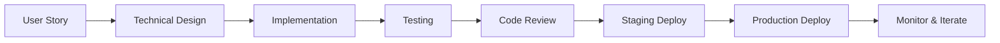

# 📘 Methodology & Development Workflows

## 🎯 Development Philosophy

### Core Principles
1. **KISS (Keep It Simple, Stupid)** - Simplicity over complexity
2. **DRY (Don't Repeat Yourself)** - Reusable components
3. **SOLID** - Clean architecture patterns
4. **YAGNI (You Aren't Gonna Need It)** - Build what's needed now
5. **Fail Fast** - Early error detection and handling

## 🔄 Development Workflow

### 1. Feature Development Cycle


### 2. Git Workflow (GitHub Flow)
```bash
# 1. Create feature branch
git checkout -b feature/amazing-feature

# 2. Make changes
git add .
git commit -m "feat: add amazing feature"

# 3. Push to GitHub
git push origin feature/amazing-feature

# 4. Create Pull Request
# 5. Code review & merge
# 6. Deploy automatically via CI/CD
```

### 3. Commit Convention
```
feat:     New feature
fix:      Bug fix
docs:     Documentation
style:    Formatting, missing semicolons, etc.
refactor: Code restructuring
test:     Adding tests
chore:    Maintenance
perf:     Performance improvements
```

## 🧪 Testing Strategy

### Testing Pyramid
```
         /\
        /  \        E2E Tests (10%)
       /    \       - User journeys
      /      \      - Critical paths
     /────────\
    /          \    Integration Tests (30%)
   /            \   - API endpoints
  /              \  - Service interactions
 /────────────────\
/                  \ Unit Tests (60%)
────────────────────  - Business logic
                      - Utilities
                      - Pure functions
```

### Test Coverage Requirements
- **Unit Tests**: > 80% coverage
- **Integration Tests**: All API endpoints
- **E2E Tests**: Critical user flows
- **Performance Tests**: Load testing for scaling

### Testing Tools
```python
# Backend Testing
pytest           # Test framework
pytest-asyncio   # Async test support
httpx           # API testing
faker           # Test data generation
coverage        # Coverage reports

# Frontend Testing
jest            # Test runner
@testing-library/react  # React testing
cypress         # E2E testing
playwright      # Cross-browser testing
```

## 🚀 Deployment Pipeline

### CI/CD Pipeline Stages
```yaml
name: Deploy Production

on:
  push:
    branches: [main]

jobs:
  test:
    steps:
      - Checkout code
      - Install dependencies
      - Run linters
      - Run unit tests
      - Run integration tests
      - Generate coverage report

  build:
    needs: test
    steps:
      - Build Docker images
      - Run security scans
      - Push to registry

  deploy:
    needs: build
    steps:
      - Deploy to staging
      - Run smoke tests
      - Deploy to production (canary)
      - Monitor metrics
      - Full rollout or rollback
```

### Deployment Strategies

#### Blue-Green Deployment
```
[Current: Blue] ──► [Load Balancer] ──► Users
[New: Green]    ──┘ (switch when ready)
```

#### Canary Deployment
```
95% traffic ──► [Stable Version]
5% traffic  ──► [New Version] (gradually increase)
```

#### Feature Flags
```python
if feature_flag.is_enabled("new_animation_engine"):
    return use_new_animation_engine()
else:
    return use_legacy_engine()
```

## 📊 Performance Optimization Methodology

### 1. Measure First
```python
import time
import logging

class PerformanceTimer:
    def __init__(self, operation_name):
        self.operation = operation_name

    def __enter__(self):
        self.start = time.time()
        return self

    def __exit__(self, *args):
        duration = time.time() - self.start
        logging.info(f"{self.operation} took {duration:.2f}s")

# Usage
with PerformanceTimer("video_generation"):
    generate_video()
```

### 2. Optimize Bottlenecks
```python
# Before: Sequential processing
for segment in segments:
    process_segment(segment)  # 10s each = 30s total

# After: Parallel processing
import asyncio
tasks = [process_segment_async(s) for s in segments]
await asyncio.gather(*tasks)  # 10s total (parallel)
```

### 3. Cache Aggressively
```python
from functools import lru_cache
import redis

# Memory caching
@lru_cache(maxsize=128)
def expensive_calculation(param):
    return complex_operation(param)

# Redis caching
def get_or_set_cache(key, generator_func, ttl=3600):
    value = redis_client.get(key)
    if value is None:
        value = generator_func()
        redis_client.setex(key, ttl, value)
    return value
```

## 🔒 Security Development Lifecycle

### Security Checklist
- [ ] Input validation on all endpoints
- [ ] SQL injection prevention (parameterized queries)
- [ ] XSS protection (content sanitization)
- [ ] CSRF tokens for state-changing operations
- [ ] Rate limiting on all public endpoints
- [ ] Authentication & authorization checks
- [ ] Sensitive data encryption
- [ ] Security headers configured
- [ ] Dependencies vulnerability scanning
- [ ] Secrets management (no hardcoded keys)

### Security Implementation
```python
from fastapi import Security, HTTPException, status
from fastapi.security import APIKeyHeader
import hashlib
import hmac

# API Key validation
api_key_header = APIKeyHeader(name="X-API-Key")

async def verify_api_key(api_key: str = Security(api_key_header)):
    if not hmac.compare_digest(api_key, INTERNAL_API_KEY):
        raise HTTPException(
            status_code=status.HTTP_401_UNAUTHORIZED,
            detail="Invalid API key"
        )
    return api_key

# Input validation
from pydantic import BaseModel, validator

class VideoRequest(BaseModel):
    duration: int

    @validator('duration')
    def validate_duration(cls, v):
        if v not in [5, 10, 20, 30, 60]:
            raise ValueError('Invalid duration')
        return v
```

## 🎨 Code Quality Standards

### Code Review Checklist
```markdown
## Functionality
- [ ] Code accomplishes the intended goal
- [ ] Edge cases are handled
- [ ] Error handling is appropriate

## Code Quality
- [ ] Code follows project style guide
- [ ] No unnecessary complexity
- [ ] DRY principle followed
- [ ] Clear variable/function names

## Testing
- [ ] Unit tests added/updated
- [ ] Integration tests if needed
- [ ] Tests are passing

## Performance
- [ ] No obvious performance issues
- [ ] Async/await used appropriately
- [ ] Database queries optimized

## Security
- [ ] No sensitive data exposed
- [ ] Input validation present
- [ ] Authentication/authorization correct

## Documentation
- [ ] Code is self-documenting
- [ ] Complex logic has comments
- [ ] API documentation updated
```

### Refactoring Patterns

#### Extract Method
```python
# Before
def process_video(video_path):
    # 50 lines of code doing multiple things

# After
def process_video(video_path):
    video_data = load_video(video_path)
    segments = extract_segments(video_data)
    enhanced_segments = enhance_segments(segments)
    return combine_segments(enhanced_segments)
```

#### Replace Magic Numbers
```python
# Before
if duration > 60:
    price = amount * 0.1

# After
MAX_DURATION_SECONDS = 60
DISCOUNT_RATE = 0.1

if duration > MAX_DURATION_SECONDS:
    price = amount * DISCOUNT_RATE
```

## 📈 Scaling Methodology

### Horizontal Scaling Decision Tree
```
Is CPU > 80%? ──Yes──► Add more instances
     │
     No
     ▼
Is Memory > 80%? ──Yes──► Optimize memory usage or add instances
     │
     No
     ▼
Is Latency > SLA? ──Yes──► Optimize code or add instances
     │
     No
     ▼
Is Queue depth growing? ──Yes──► Add more workers
     │
     No
     ▼
System is healthy
```

### Database Optimization Strategy
1. **Indexing**: Add indexes for frequently queried fields
2. **Denormalization**: Trade storage for query speed
3. **Caching**: Redis for hot data
4. **Sharding**: Distribute data across multiple instances
5. **Read Replicas**: Separate read and write operations

## 🐛 Debugging Methodology

### Debugging Workflow
```python
import logging
import traceback
from contextlib import contextmanager

# Enhanced logging
logging.basicConfig(
    level=logging.INFO,
    format='%(asctime)s - %(name)s - %(levelname)s - %(message)s'
)

@contextmanager
def debug_context(operation_name):
    """Context manager for debugging operations"""
    logger = logging.getLogger(__name__)
    logger.info(f"Starting: {operation_name}")

    try:
        yield
    except Exception as e:
        logger.error(f"Failed: {operation_name}")
        logger.error(f"Error: {str(e)}")
        logger.error(f"Traceback: {traceback.format_exc()}")
        raise
    else:
        logger.info(f"Completed: {operation_name}")

# Usage
with debug_context("video_generation"):
    generate_video()
```

### Troubleshooting Guide
```yaml
Symptom: Video generation fails
Diagnosis:
  1. Check Replicate API status
  2. Verify API key validity
  3. Check input image format
  4. Review FFmpeg logs
  5. Verify GCS permissions

Symptom: Payment not processing
Diagnosis:
  1. Check Stripe webhook logs
  2. Verify webhook signature
  3. Check network connectivity
  4. Review payment intent status
  5. Check for duplicate processing

Symptom: High latency
Diagnosis:
  1. Check database query performance
  2. Review Cloud Run metrics
  3. Analyze cold start frequency
  4. Check external API response times
  5. Review async task processing
```

## 🔄 Continuous Improvement

### Metrics-Driven Development
```python
# Track everything
metrics = {
    "video_generation_time": [],
    "api_response_time": [],
    "payment_success_rate": [],
    "user_satisfaction": []
}

# Analyze trends
def analyze_performance_trends():
    p50 = np.percentile(metrics["video_generation_time"], 50)
    p95 = np.percentile(metrics["video_generation_time"], 95)

    if p95 > SLA_THRESHOLD:
        trigger_optimization_sprint()
```

### Retrospective Template
```markdown
## Sprint Retrospective

### What went well?
- Feature X shipped on time
- Zero production incidents
- Improved test coverage to 85%

### What could be improved?
- Code review turnaround time
- Documentation updates lagging
- Technical debt accumulating

### Action items
- [ ] Implement automated documentation
- [ ] Schedule technical debt sprints
- [ ] Improve CI/CD pipeline speed
```

## 🎯 Best Practices Checklist

### Daily Development
- [ ] Write tests before code (TDD)
- [ ] Review your own code before PR
- [ ] Update documentation
- [ ] Check for security issues
- [ ] Performance impact considered

### Code Hygiene
- [ ] No commented-out code
- [ ] No console.logs in production
- [ ] Error messages are helpful
- [ ] No hardcoded values
- [ ] Consistent naming conventions

### Production Readiness
- [ ] Feature flags for risky changes
- [ ] Rollback plan documented
- [ ] Monitoring alerts configured
- [ ] Load testing completed
- [ ] Documentation updated

---

*These methodologies have been battle-tested in production with 10,000+ users and millions of API calls.*